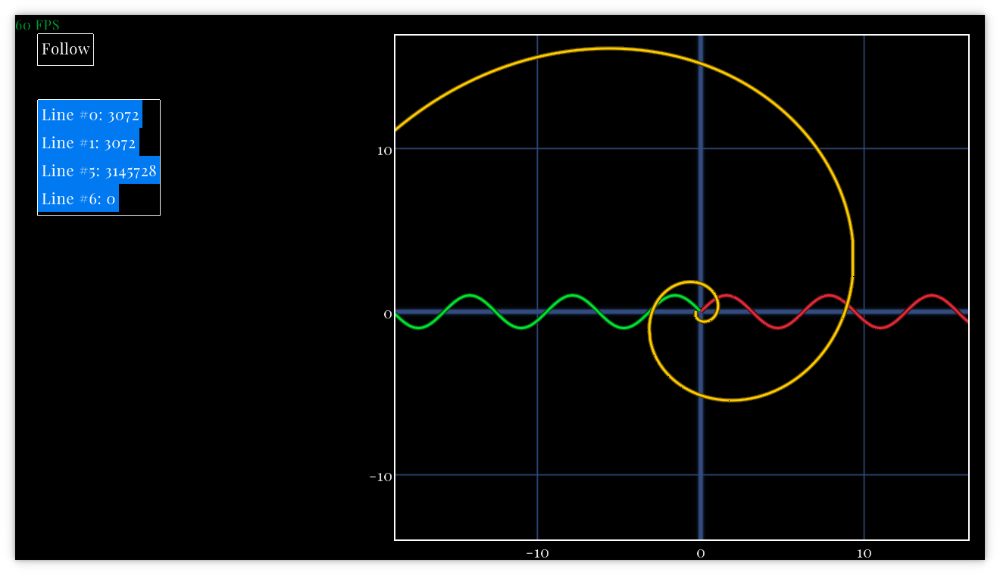
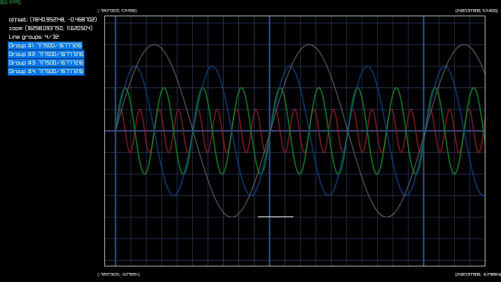
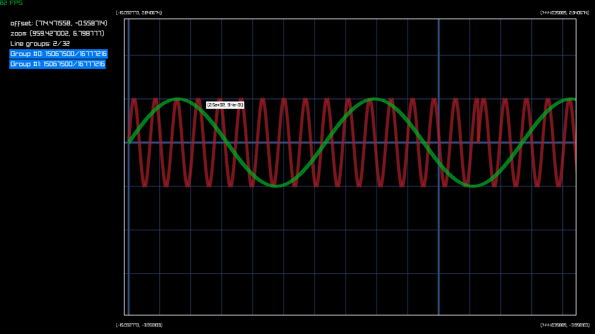
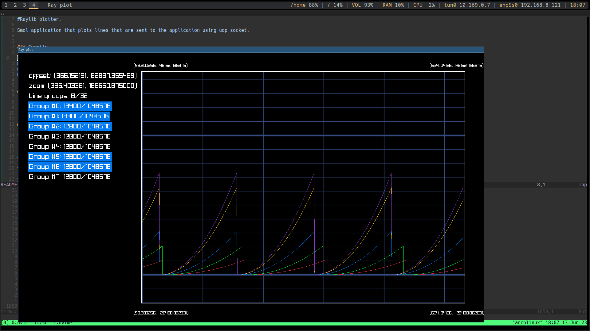

# Rlplot

Small application that plots lines that are sent to the application's stdin.

## Compile

Rlplot can be built using GNU make ( using gcc internally ) or using [Zig](https://github.com/ziglang/zig) ( zig is love ). Use whatever you like.

### Using zig for linux

```bash
zig build -Doptimize=ReleaseFast
```

### Using zig for windows
```bash
zig build -Dtarget=x86_64-windows-gnu -Doptimize=ReleaseSmall
```

### Using make for linux ( using gcc internally )
```bash
make
```

### Using make for windows ( but using zig internally... )
```bash
make windows
```

### Using make for web
```bash
EMSCRIPTEN="path to emscripten" make www/index.wasm
```

## Install
When built, rlplot is only one file and you can install it using ```install``` command. Here I'm installing it to ```/usr/bin``` directory, but this can be any other directory...

```bash
sudo install zig-out/bin/rlplot /usr/bin/rlplot
```

## Clean
```bash
make clean
```

## Uninstall
```bash
sudo rm /usr/bin/rlplot
```

## Run
rlplot is designed in such a way that it plays nicely with other unix tools. You can just pipe the output of your program to rlplot and rlplot will do it's best to plot your data.

### Examples
I think that more or less all the examples listed on [ttyplot examples](https://github.com/tenox7/ttyplot#examples) should work with rlplot ( just replace ttyplot with rlplot. )
But here are some more examples:

#### Plot the first 8 Fibonacci numbers from user input
```bash
rlplot
1 1 2 3 5 8 13 21
```

#### Nice Plot
```bash
# Plot numbers from 1 to 69
seq 69 | rlplot;
```

#### Square(Nice) Plot
```bash
# Plot squeres of numbers from 1 to 69
python -c "[print(x*x) for x in range(69)]" | rlplot;
```

#### Plot from data that is streamed to an UDP socket
```bash
nc -ulkp 42069 | rlplot;
```

#### Plot from data that is streamed to a TCP socket
```bash
nc -lkp 42069 | rlplot;
```

#### Plot random data
```bash
# This will most likely crash
cat /dev/random | rlplot;
```

#### Plot the temperature of core 0 on your CPU.

```bash
#Plot temeratur of core 0 on your cpu.

# Step 0: Get sensors value
sensors;
# output:
#...
#Package id 0:  +52.0°C  (high = +105.0°C, crit = +105.0°C)
#Core 0:        +52.0°C  (high = +105.0°C, crit = +105.0°C)
#Core 1:        +52.0°C  (high = +105.0°C, crit = +105.0°C)
#...

# Step 1: Grep Core 0:
sensors | grep 'Core 0';
#output:
#Core 0:        +52.0°C  (high = +105.0°C, crit = +105.0°C)

# Step 2: Get only temperature:
sensors | grep 'Core 0' | awk -p '{print $3}';
# output:
# +52.0°C 

# Step 3: Create a loop and pipe the value of core temperature to rlplot every 0.1 sec.
while :; do echo $(sensors | grep 'Core 0' | awk -p '{print $3}'); sleep 0.1; done | rlplot
# rlplot should not care about nonnumeric symbols So input `+52.0°C` should be fine.
```

#### Plot temperature of all CPU core 0.
```bash
while :; do echo $(sensors | grep 'Core' | awk -p '{print substr($3, 1, 4) ";" $2}'); sleep 0.1; done | rlplot
# substr is needed because "+52.0C;1" would be recogined as:
# Add 52 to group 0
# Add 1 to group 1
# substr transforms "+52.0C" to "52.0", so one awk will output lines like "52.0;0"
```

#### Plot ram usage.
```bash
while :; do echo $(free | grep Mem | awk -p '{print $3/1024}'); sleep 0.01; done | ./zig-out/bin/rlplot
```

#### UDP client in python

* Write an UDP client in python:
```python
import socket

client_socket = socket.socket(socket.AF_INET, socket.SOCK_DGRAM)
y_value = 69 # This can be any float32 value
group_id = 420 # This can be any int32 value
port_number = 42069 # This is a port number and it MUST be 42069
client_socket.sendto(f"{y_value};{group_id}".encode(), ("localhost", port_number))
```

Start rlplot that listens to UDP port 42069:
```bash
nc -ulkp 42069 | rlplot;
```

### Input format
```[[x-value],]y-value[;[line-index]]```

#### Input examples
* 10 - insert point (new_x, 10) to line group 0
* 10;1 - insert point (new_x, 10) to line group 1
* 10,12;2 - insert point (10, 12) to line group 2

### Controls

#### Controls are only active when mouse is over the grap.

* Right mouse button + Move mouse - Change offset
* Mouse wheel - Change zoom
* **X** + Mouse Wheel - Change zoom only in **X** axis
* **Y** + Mouse Wheel - Change zoom only in **Y** axis
* [**X**|**Y**] + [**LSHIFT**|**LCRTL**] - Change zoom [in|out] only in [**X**|**Y**] axis
* **F** - Follow the visible lines. ( Camera will focus on the average of newest points added to each visible line. )
* [**K**|**J**] - Change recoil for follow functionality ( quite fun if >1.f )
* **T** - Add test points
* **C** + **LSHIFT** - Clear all points
* **C** - Empty all points
* **R** - Reset camera offset and zoom to (0, 0) and (1, 1)
* **R** + **LSHIFT** - Reset camera zoom to (1, 1)
* **R** + **LCTRL** - Reset camera offest to (0, 0)
* **D** - Toggle debug view.
* **S** - Grab a screenshot.
* **H** - Hide all lines.
* **H** + **LSHIFT** - Toggle visiblity of all lines.

#### Controls are only active if mouse is over element in list of graphs
* **C** + **LSHIFT** - Clear all points in line which the mouse is over.
* **C** - Empty all points over which the mouse is over.
* Left mouse button - Toggle visiblity of the line over which the mouse is over


### Todo
* ~~Make drawing lines use buffers ( Don't use DrawLineStrip function by raylib. ) Maybe use DrawMesh? It's ok for plots with ~1'000'000 points, but I want more!~~
  * Implemented this now. For every line, 2 triangles are created. Old points are put in buffers and are drawn like that. Plotter can now handle 30'000'000 points, easy.
* When having many points ( 30'000'000 ), a few probles ocure:
  * Distant points start being rounded up/down to the closest float. It doesn't look right.
  * ~~When zoomed out a lot. It becomes quite slow. ( I guess there is a lot of drawing of the same pixel.. )~~
    * Maybe combine few lines that are close when zoomed out... ( how to detect this ? )
    * This is partly fixed for plots where x values are sorted.
    * ~~Problem still remains if x values aren't sorted.~~
      * This is now solved by finding intervals in which numbers are sorted one way or the other.
      * But still there is a worst case when every line is in different interval, and it will cause it to once aging be slow.
  * Maybe use geometry shader ( don't generate triangles on cpu. )
  * ~~Gpu memory usage will be lower. Current gpu memory usage:~~
    * ~~(N lines)*(2 triangles per line)*(3*vertices per triangle)*((3 floats for position) + (3 float for tangents))*(4 bytes per float)~~
    * ~~If N = 64'000'000, gpu usage will be ~9GB. This seems high...~~
    * This is partly fixed. If plot values are sequential gpu memory usage can be constant with regard to number of points.
    * ~~Problem still remains if x values aren't sorted.~~
        * ~~This is now solved by using quad tree structure for storing data points.~~
        * ~~Still there is work to be done to make quad tree structure closer to optimal.~~
        * This is now solved by finding intervals in which numbers are sorted one way or the other.
* ~~I'm not happy with the thickness of the line when zooming in and out.~~
  * ~~It's not that bad, but it's inconsistent.~~
  * Made is consistent. And now it's smooth af.
* ~~Quad tree rectangles are not inside one another, bounds of the outer quad are smaller than those of the inner quad. Fix this...~~
  * I deleted everything that had anything to do with quad trees so this is not a problem anymore.
* ~~Text looks like shit... I don't know how to fix it...~~
  * Text doesn't look like shit any more. I found a way to fix it.
* ~~Values on x,y axis should be on each horizontal and vertical line. ( Not in corners. )~~
  * Did this and it looks awesome.
* Colors should be configurable. Black background is the best background, but maybe there will be a need for a white background.
  * This will require having a configuration file ( Maybe )
  * Or parse tty codes for changing colors... hmmm ( could be cool )
    * Does ttyplot do this ??
* Add something to plot points. ( scatter plot )
  * This will most likely require the use of quad tree, once again..
* Add something for testing the UI.
  * I want to record my actions and that play that back to see if something will segfault...
  * This will require, I guess some kind of rework of input handling.
    * A structure will have to be introduced that stores two function pointers. One predicate and one action. Each frame call that predicate and if true call action.
  * I saw pull request on raylib for something like that. But Ray answered that he has to look at the API more closely.
  * ~~Maybe create something that does not depend on glfw and can be tested on headless servers. This would enable me to run those tests on github ci.~~
    * Implemented this. On its own, this feature is useful, already found 1 double free.
    * This is more or less now fuzz testing. I like it.
* Nicer UI for setting color of a line, if it's show, maybe to export data to file or stdout.
* Stack panel improvements
  * make it more general. So that it accepts any kind of element, not just button
  * add like a scroll bar on the left size of a stack
* Zig build doesn't build tools/font_export.c... Make zig build that also, else default_font.h can't be created.
* ~~Export image with numbers.~~
  * This now works more or less. Still needs a better UI and ability to change image resoultion. For now it's hardcoded
  * Make screenshots work on Web
  * Something to change screenshot resolution.
  * Something to change screenshot name. ( Or at least directory, and then set a name to a timestamp or something... )
* ~~Fix negative zero~~
* ~~Zoom in on the location where the mouse is located, not on center of the screen.~~
  * Fix with the help of my favorite brother Andrija.
* Export of data to a text file.
  * ~~Export to format readable by rlplot.~~
  * ~~Export to csv.~~
  * This will require some sort of file explorer to be implemented.
* Export the whole graph ( That includes current offset and current zoom )
  * This will require setting current offest and zoom from stdin ( Extend input format to handle this. )
    * Maybe something like ``--setzoomx 69.0``
* Support for touch input.
  * Support for draging with one finger.
  * Support for multitouch zoom.
* There is something wrong with new tokenizer. Fix this!!


### Screenshot
Here is a history of how rlplot looked over time:

##### 2023-09-30

##### 2023-06-16

##### 2023-06-15

##### 2023-06-13


### License

MIT
